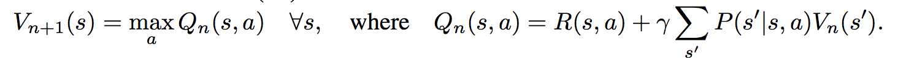
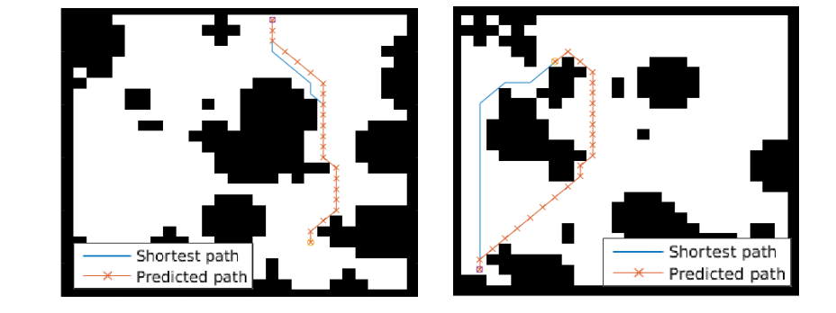
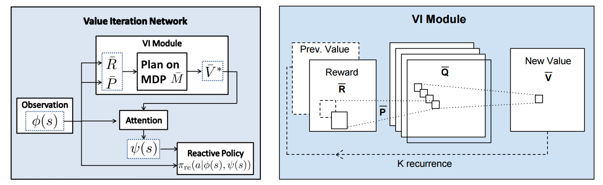
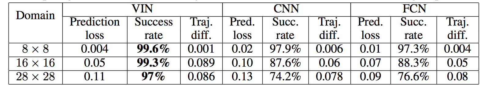

# Value Iteration Networks

**By Berkeley group: Aviv Tamar, Yi Wu, Garrett Thomas, Sergey Levine, and Pieter Abbeel**

[Paper link](http://arxiv.org/abs/1602.02867).

This paper introduces a policy network architecture for RL tasks that has an embedded differentiable *planning module*, trained end-to-end. It hence falls into a category of fun papers that take explicit algorithms, make them differentiable, embed them in a larger neural net, and train everything end-to-end.

**Observation**: in most RL approaches the policy is a "reactive" controller that internalizes into its weights actions that historically led to high rewards.

**Insight**: To improve the inductive bias of the model, embed a specifically-structured neural net planner into the policy. In particular, the planner runs the value Iteration algorithm, which can be implemented with a ConvNet. So this is kind of like a model-based approach trained with model-free RL, or something. Lol.

NOTE: This is very different from the more standard/obvious approach of learning a separate neural network environment dynamics model (e.g. with regression), fixing it, and then using a planning algorithm over this intermediate representation. This would not be end-to-end because we're not backpropagating the end objective through the full model but rely on auxiliary objectives (e.g. log prob of a state given previous state and action when training a dynamics model), and in practice also does not work well.

NOTE2: A recurrent agent (e.g. with an LSTM policy), or a feedforward agent with a sufficiently deep network trained in a model-free setting has some capacity to learn planning-like computation in its hidden states. However, this is nowhere near as explicit as in this paper, since here we're directly "baking" the planning compute into the architecture. It's exciting.

## Value Iteration

Value Iteration is an algorithm for computing the optimal value function/policy $V^*, \pi^*$ and involves turning the Bellman equation into a recurrence:

This iteration converges to $V^*$ as $n \rightarrow \infty$, which we can use to behave optimally (i.e. the optimal policy takes actions that lead to the most rewarding states, according to $V^*$). 

## Grid-world domain

The paper ends up running the model on several domains, but for the sake of an effective example consider the grid-world task where the agent is at some particular position in a 2D grid and has to reach a specific goal state while also avoiding obstacles. Here is an example of the toy task:

 

The agent gets a reward +1 in the goal state, -1 in obstacles (black), and -0.01 for each step (so that the shortest path to the goal is an optimal solution).

## VIN model

The agent is implemented in a very straight-forward manner as a single neural network trained with TRPO (Policy Gradients with a KL constraint on predictive action distributions over a batch of trajectories). So the only loss function used is to maximize expected reward, as is standard in model-free RL. However, the policy network of the agent has a very specific structure since it (internally) runs value iteration.

First, there's the core Value Iteration **(VI) Module** which runs the recurrence formula (reproducing again):

The input to this recurrence are the two arrays R (the reward array, reward for each state) and P (the dynamics array, the probabilities of transitioning to nearby states with each action), which are of course unknown to the agent, but can be predicted with neural networks as a function of the current state. This is a little funny because the networks take a _particular_ state **s** and are internally (during the forward pass) predicting the rewards and dynamics for all states and actions in the entire environment. Notice, extremely importantly and once again, that at no point are the reward and dynamics functions explicitly regressed to the observed transitions in the environment. They are just arrays of numbers that plug into value iteration recurrence module.

But anyway, once we have **R,P** arrays, in the Grid-world above due to the local connectivity, value iteration can be implemented with a repeated application of convolving **P** over **R**, as these filters effectively *diffuse* the estimated reward function (**R**) through the dynamics model (**P**), followed by max pooling across the actions. If **P** is a not a function of the state, it would simply be the filters in the Conv layer. Notice that posing this as convolution also assumes that the env dynamics are position-invariant. See the diagram below on the right:

Once the array of numbers that we interpret as holding the estimated $V^*$ is computed after running **K** steps of the recurrence (K is fixed beforehand. For example for a 16x16 map it is 20, since that's a bit more than the amount of steps needed to diffuse rewards across the entire map), we "pluck out" the state-action values $Q(s,.)$ at the state the agent happens to currently be in (by an "attention" operator $\psi$), and (optionally) append these Q values to the feedforward representation of the current state $\phi(s)$, and finally predicting the action distribution.

## Experiments

**Baseline 1**: A vanilla ConvNet policy trained with TRPO. [(50 3x3 filters)\*2, 2x2 max pool, (100 3x3 filters)\*3, 2x2 max pool, FC(100), FC(4), Softmax].

**Baseline 2**: A fully convolutional network (FCN), 3 layers (with a filter that spans the whole image), of 150, 100, 10 filters. i.e. slightly different and perhaps a bit more domain-appropriate ConvNet architecture.

**Curriculum** is used during training where easier environments are trained on first. This is claimed to work better but not quantified in tables. Models are trained with TRPO, RMSProp, implemented in Theano.

Results when training on **5000** random grid-world instances (hey isn't that quite a bit low?):

TLDR VIN generalizes better.

The authors also run the model on the **Mars Rover Navigation** dataset (wait what?), a **Continuous Control** 2D path planning dataset, and the **WebNav Challenge**, a language-based search task on a graph (of a subset of Wikipedia). Skipping these because they don't add _too_ much to the core cool idea of the paper.

## Misc

**The good**: I really like this paper because the core idea is cute (the planner is *embedded* in the policy and trained end-to-end), novel (I don't think I saw this idea executed on so far elsewhere), the paper is well-written and clear, and the supplementary materials are thorough.

**On the approach**: Significant challenges remain to make this approach more practically viable, but it also seems that much more exciting followup work can be done in this framework. I wish the authors discussed this more in the conclusion. In particular, it seems that one has to explicitly encode the environment connectivity structure in the internal model $\bar{M}$. How much of a problem is this and what could be done about it? Or how could we do the planning in more higher-level abstract spaces instead of the actual low-level state space of the problem? Also, it seems that a potentially nice feature of this approach is that the agent could dynamically "decide" on a reward function at runtime, and the VI module can diffuse it through the dynamics and hence do the planning.  A potentially interesting outcome is that the agent could utilize this kind of computation so that  an LSTM controller could learn to "emit" reward function subgoals and the VI planner computes how to meet them. A nice/clean division of labor one could hope for in principle.

**The experiments**. Unfortunately, I'm not sure why the authors preferred breadth of experiments and sacrificed depth of experiments. I would have much preferred a more in-depth analysis of the gridworld environment. For instance:

- Only 5,000 training examples are used for training, which seems very little. Presumable, the baselines get stronger as you increase the number of training examples?
- Lack of visualizations: Does the model actually learn the "correct" rewards **R** and dynamics **P**? The authors could inspect these manually and correlate them to the actual model. This would have been reaaaallllyy cool. I also wouldn't expect the model to exactly learn these, but who knows.
- How does the model compare to the baselines in the number of parameters? or FLOPS? It seems that doing VI for 30 steps at each single iteration of the algorithm should be quite expensive.
- The authors should study the performance as a function of the number of recurrences **K**. A particularly funny experiment would be K = 1, where the model would be effectively predicting **V*** directly, without planning. What happens?
- If the output of VI $\psi(s)$ is concatenated to the state parameters, are these Q values actually used? What if all the weights to these numbers are zero in the trained models?
- Why do the authors only evaluate success rate when the training criterion is expected reward?

Overall a very cute idea, well executed as a first step and well explained, with a bit of unsatisfying lack of depth in the experiments in favor of breadth that doesn't add all that much.