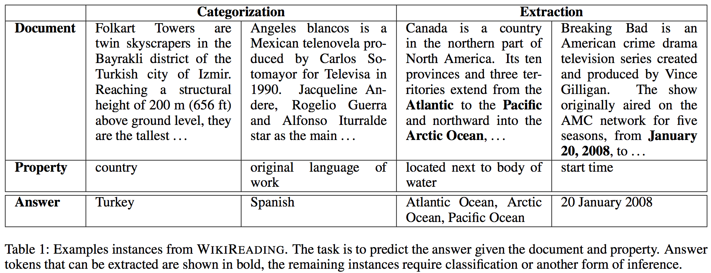
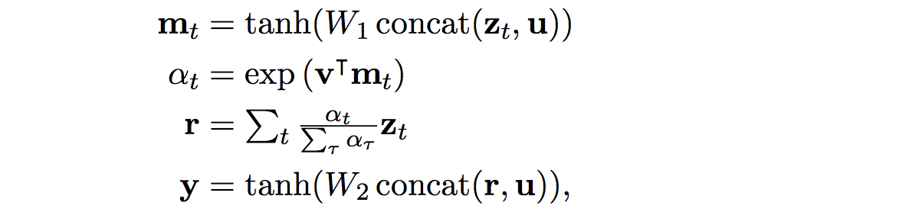
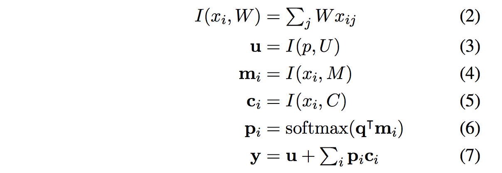
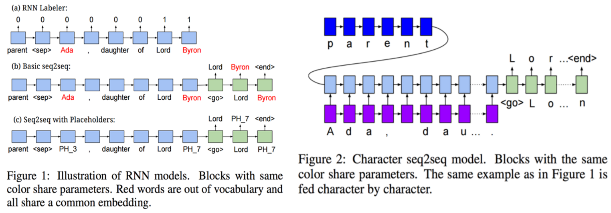
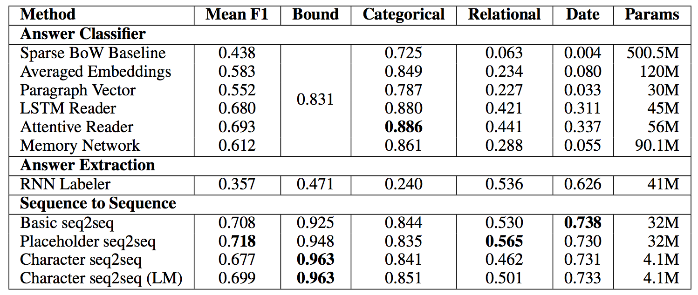

# WikiReading paper notes

Daniel Hewlett, Alexandre Lacoste, Llion Jones, Illia Polosukhin, Andrew Fandrianto, Jay Han, Matthew Kelcey and David Berthelot, **Google Research**.

**Pdf link**: http://www.aclweb.org/anthology/P/P16/P16-1145.pdf

**Data release link**: http://goo.gl/wikireading

18.58M instances across 884 sub-tasks of reading comprehension: text classification, information extraction. Task: predict textual values from **Wikidata** given text **from Wikipedia articles**. Examples form the dataset (cool; wish there were more in appendix or so...):

## WikiReading dataset

**Wikidata**: 16M items with 80M statements across 844 properties. Each statement is (property, value) tuple. E.g. item Paris has statement (country, France).

**Wikireading**: 

- Instead consolidate all to (item, property, {answer}), where `item` is replaced with the text of the linked Wikipedia article. 
- This involves 4.7M unique Wikipedia articles (i.e. ~80% of English Wikipedia is represented). 
- Most common categories are human, taxon, film, album, human settlement (~50% of docs).
- Mean/median document lengths are 489.2, 203 words
- 30% of the answers in the test set are not in training data answers (i.e. must be "read out" from the document).

#### On a side: related datasets

- WIKIQA (Yang et al 2015): only thousands of examples (too small for end-to-end)

- NEWS dataset (Hermann et al 2015): 1M instances

- bAbI dataset (Weston et al 2015): synthetically generated

WIKIQA and NEWS both involve pointing to locations within the document.

## Methods: Classification

In this case we have a finite number of possible answers, so there's an encoding of item,property to a vector **y** which goes into a Softmax classifier over the finite number of categories.

- **BoW baseline**: encode both `item` and `property` to BoW vectors, concat, linear classify to fixed number of answers with Softmax (or Logistic Regression? (since it's multi-label setting))
- **Neural Net BoW**: embed `item` and `property` by averaging word representations in both separately, concat, classify.
- **Paragraph Vector**: encode the item with paragraph vector (Le and Mikolov 2014, PV-DBOW model; an unsupervised method). No fine-tuning throught the model.
- **LSTM encoders**: use last hidden representation of an LSTM that "read" both item/property separately. Presumable these are concatenated into vector **y** that ships off to the Softmax.
- **Attentive Reader** from Hermann et al. 2015: Encode the property with an LSTM reader into vector **u**. Then encode the document words into vectors **z**_t using another LSTM. Then produce an attention mask over the document based on concatenation of **(u,z_t)** for all t, and use it to do a weighted sum on **z** to get **r**. Finally, compute the output encoding **y** (which goes into final softmax classifier) with one more layer as a function of **(r,u)**. The concrete equations are: 
  where **v** is a learned vector, so attention is a soft-maxed output of a small 2-layer neural net. Also note to self: isn't it a problem that LSTMs are one-directional? what if the the relevant words containing an answer for a property are found preceding the property "identifier" in text?

- **Memory Network** of Sukhbaatar et al 2015, which maps the property **p** and sequence of sentences **x_1, …, x_n** to single joint representation **y** as follows. Each sentence in the item (document) is encoded to a key vector **m** and a content vector **c** and property into a lookup vector **u**. The attention over sentences is computed independently of the property vector, and used to average the content vectors. The output vector **y** is the sum:

Note that this is kind of weird: the document is encoded separately from the query information, and they only interact additively at the very end in Equation (7), and the vector **y** is shipped off directly to the (linear!) classifier. It's less intuitive than the Attentive Reader, and will be later shown to also work slightly worse.

## Methods: Answer Extraction with "RNN Labeler"

quries that concern date of birth, mother, author etc have too many possible answers to be handled in a classification framework.

**RNN Labeler** approach: predict probability of each word being part of the answer. During training annotate document at all occurrences of answer with 1, 0 otherwise. For multi-word answers exact match is required. Instances where answers don't appear are discarded. At test: sequences of consecutive locations scoring above a threshold are chunked into single answer, and top-scoring answer is recorded. 

This approach is slightly gross, not end to end, and restricted to only predicting words that are verbatim in the document as answers. Also, writeup is a bit vague on how the property is conditioned on in the RNN. Figure 1 seems to suggest that the property is prepended to the document? This seems like a very weak form of conditioning that is bound to fail from the start.

## Methods: Answer Extraction with Sequence to Sequence

- **Basic seq2seq**: Encode the (item,property) with one LSTM, decode the answer with another in a basic Sutskever et al. Seq2Seq manner. The word embedding is shared but LSTM dynamics aren't. The paper is unfortunately very vague here - how are the item and property encoded exactly? Would make sense to maybe encode each, then concatenate? Figure 1 seems to incidate the property is read first and the document next.
- **Placeholder seq2seq**: An extension inspired by Luong et al. 2015 / Hermann et al. 2015, where out of vocabulary (OOV) words are replaced at random by one of finite number of placeholder vectors. The softmax word classifier is similarily extended to contain these placeholder words. Just a note: this is really *weird*, since the training has to learn across an entire cross product of placeholder replacements. It feels wrong, but I also can't come up with anything much better.=, except for:
- **Character seq2seq**: Characters all the way! No such thing as OOV words, weird preprocessing techniques etc., but at the cost of doing much more compute and having much longer dependencies. I like this because the least amount of arbitrary non-differentiable decisions are made.
- **Character seq2seq with pretraining**: train a character-level LM on the training data first as initialization (shown as sensible by Dai and Le 2015).

 

One more note: these models are suspicious in how lazily they encode the (item, property). It seems they read the property first, and then they read the item for many next time steps, likely nearly forgetting the property by the end. Wouldn't it be much more sensible to use very simple attention here, or "plug in" the property at each time step, or at the last time step etc… many other easy and sensible possibilities here.

## Experiements

**Eval criterion**: Use Mean F1-score (harmonic mean of precision and recall) due to multiple possible answers; this measures "degree of overlap" between predicted answer and true answer. Details are a bit sparse here, do they segment multiple answers with e.g. a comma? Since most questions in the dataset have a single answer, F1-score ~= accuracy.

**Prepro:** Whoa, "all documents are truncated to first 300 words, except in char seq2seq to 400 characters" - that is short!. 

**Hyperparams:** TensorFlow implementation. Embeddings are 300D. Vocab size 100,000 most freq words. Answer classification is over 50,000 words, "answer representation size is 300" - wait, is this not a Softmax? RNNs are GRUs with 1024 cells. Opt with Adam of (beta1 0.9, beta2 0.999, eps 1e-8). Grad clipping done proportionally to threhold norm C (not mentioned if seqlength/batches are normalized in loss). Learning rate in 1e-5 to 1e-2, C in [1e-3, 1e1], selected as best from 50.

**Results!!** As follows: 

**Attentive Reader works well on cls**: Attentive reader performs best at classification, as it intuitively should imo. I'm slightly surprised that the LSTM reader performs nearly as well (0.880 vs 0.886) - note it also has fewer params (45M vs 56M).

**Order of words has ~little info**: LSTM Reader is 0.880 vs. Averaged Embeddings is 0.849, so order of words information here is adding approx ~0.031of accuracy. This is not a supergreat apples-to-apples comparison though.

**More frequent classes work better**, shown in Figure 3. Expected, interesting to see quantitatively. Softmax classifier doesn't share statistcal strength across candidate answers. Could have been interesting to maybe model the networks are (item, property, candidate answer) -> probability. This way the answers wouldn't blow up the softmax, and inference would be much slower and require a gross loop, but answers could share statistical strength.

**Char RNNs works surprisingly well**. Quite surprised to see char seq2seq do 0.699 vs. placeholder seq2seq at 0.718 (and with ~8x less params, but possibly with more FLOPs (would be fun to see this comparison too in the table)). That's not a huge delta; encouraging! And this only uses the first 400 characters (instead of 300 words, which should be much more information/context!) of the document and with no attentions/other fanciness. **Pretraining** is mentioned to help with convergence, final performance, and hyperparameter sensitivity.

**No attention fancy models for seq2seq**; wish these experiments were included. Would expect an additional bump, as is the case in the categorical setting.

## Conclusions

Lets push fully end-to-end character rnn models further. 

